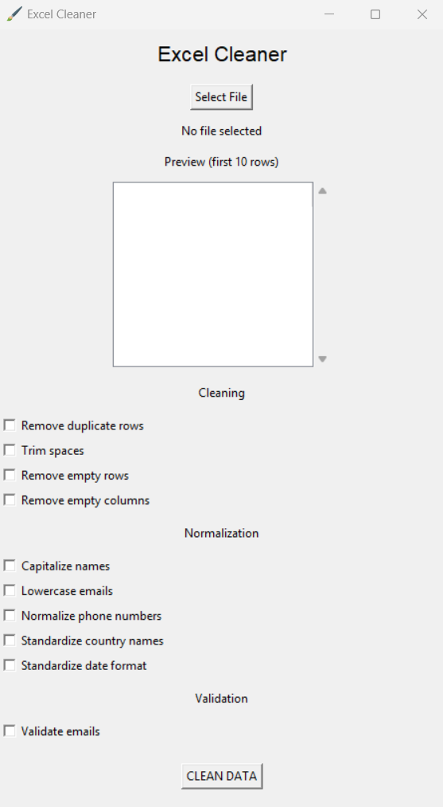
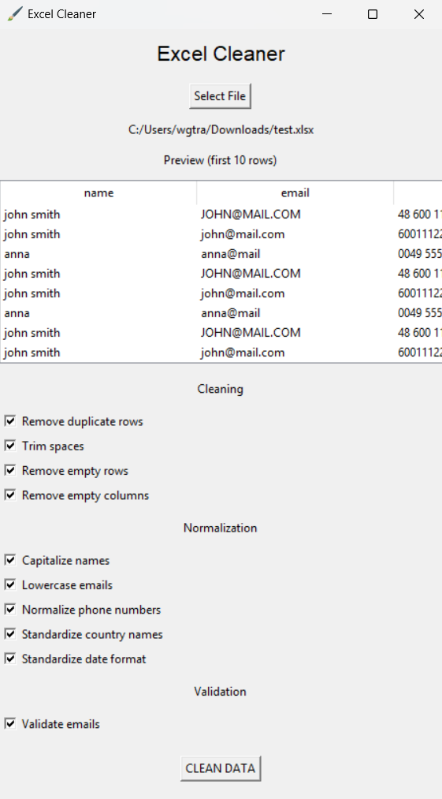
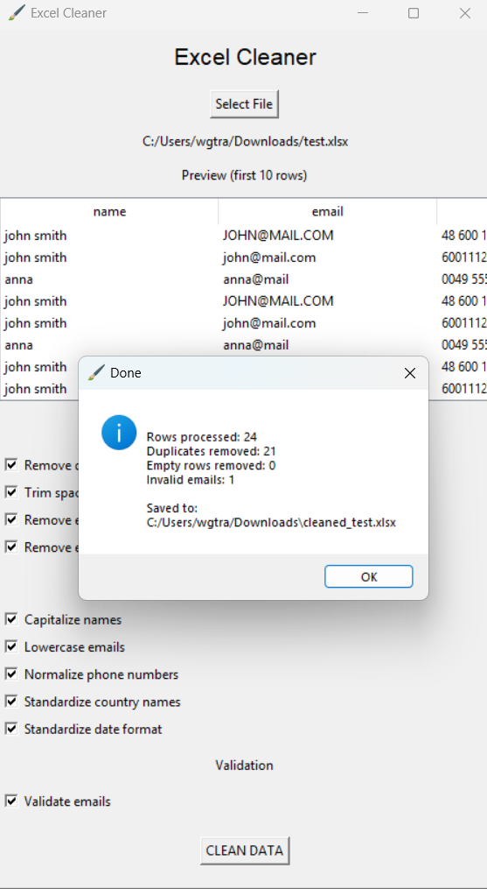

# Excel Cleaner

Excel Cleaner is a desktop GUI tool for cleaning messy Excel and CSV datasets.

The application helps users quickly normalize and validate spreadsheet data using a simple graphical interface.

---

## Features

- Remove duplicate rows
- Trim unnecessary spaces
- Remove empty rows and columns
- Capitalize names automatically
- Convert emails to lowercase
- Normalize phone numbers
- Standardize country names
- Standardize date formats
- Validate email addresses
- Preview dataset before cleaning
- Cleaning progress bar
- Automatic export of cleaned file

---

## Supported file formats

- `.xlsx`
- `.xls`
- `.csv`

---

## Screenshots

### Dataset preview



### Cleaning process



### Cleaning report



---

## Installation

Clone the repository:

```bash
git clone https://github.com/czuameni/excel-cleaner.git